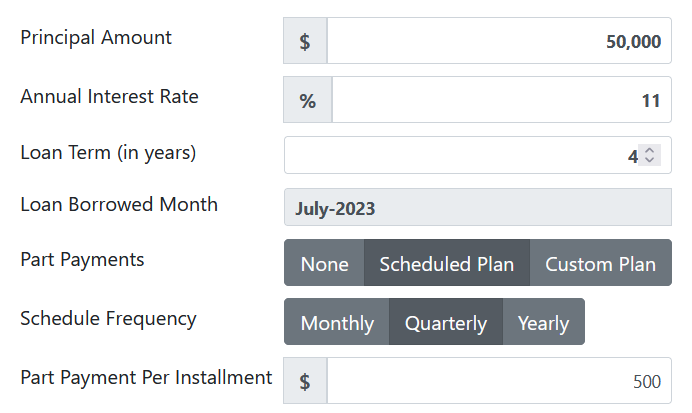
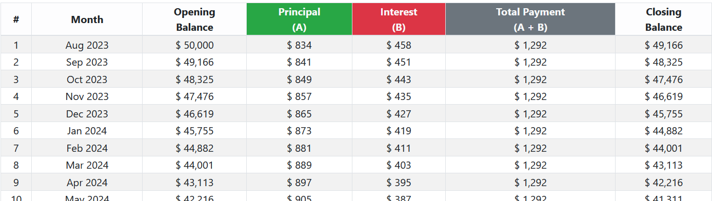
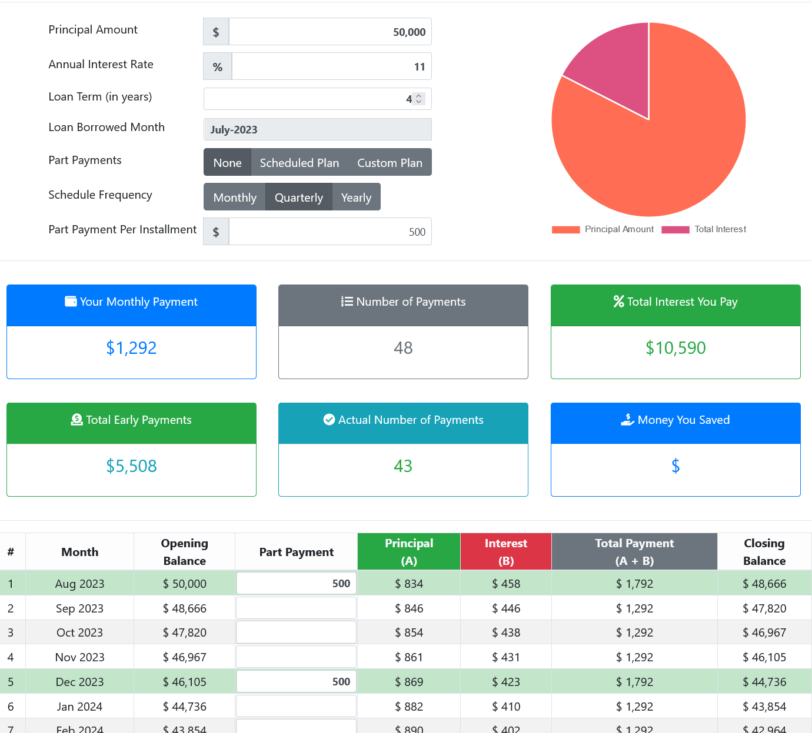

# Loan Amortization Planer

Loan Amortization Planer is a simple vanila JavaScript based loan amortization planner application. It helps to calculate.

- EMI of an loan
- Planning part payments of loan with scheduled intervals (Monthly, Quarterly and Yearly)
- Planning ad-hoc part payments
- Helps calculating the impact after part-payments

Live Site: https://javadurai.github.io/loan-amotization-calculator/

### EMI calculator fields - basic

### EMI schedule

### EMI calculator fields - With part-payment

